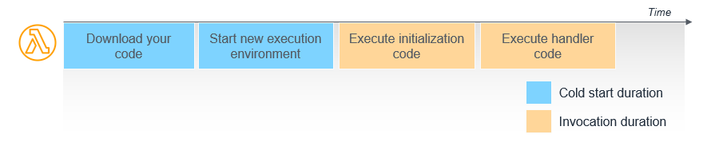

# Lambda Explained: A Visual Journey from Init to Invoke

## Introduction: Why Lambda Behaves the Way It Does

AWS Lambda has revolutionized how developers build and run applications by abstracting away server management and offering automatic scaling. But despite its popularity, many users do not fully understand some core behaviors — like why the first request to a Lambda function can take noticeably longer (the infamous cold start), or why each Lambda “instance” only handles one request at a time, even when multiple requests come in simultaneously.

This article will explain how the Lambda runtime manages function execution using the **Lambda Runtime API**, how the official Go SDK ([aws-lambda-go](https://github.com/aws/aws-lambda-go)) interfaces with it, and why these details matter for performance and scaling.
To make this tangible, I built a demo web app that simulates Lambda’s behavior by spawning isolated Go processes, each acting like a Firecracker microVM handling a single request. The app visualizes cold starts, warm invocations, and concurrent scaling on a timeline, so you can see Lambda’s internal workings in action.

This article will focus on **synchronous invocations** (e.g., API Gateway calling a Lambda and waiting for the response) rather than **asynchronous invocations** (like S3 events or EventBridge, where events are queued and processed later). Synchronous invokes are where cold starts, latency, and concurrency limits are most directly visible to end users, making them the clearest way to understand how the Lambda runtime behaves.

By the end, you’ll have a clearer picture of Lambda’s architecture, why cold starts happen, and how your functions scale — empowering you to write more efficient serverless applications.

> 🔗 The source code and demo are available on github at [mayaankvad/lambda-visualizer](https://github.com/mayaankvad/lambda-visualizer)

## The Lifecycle of a Lambda Execution Environment

AWS Lambda runs your function code inside isolated execution environments called microVMs, built on Firecracker. Each environment goes through a lifecycle consisting of three main phases: **Init**, **Invoke**, and **Shutdown**.

Below is a high-level illustration of the [lifecycle](https://docs.aws.amazon.com/lambda/latest/dg/lambda-runtime-environment.html#cold-start-latency):


This diagram shows how the Init phase prepares the execution environment, the Invoke phase runs your handler for each request, and the Shutdown phase cleans everything up. Understanding what happens in each phase helps explain Lambda behaviors like cold starts and how scaling works under the hood.

> 👉 The official AWS documentation on [Lambda Execution Environment Lifecycle](https://docs.aws.amazon.com/lambda/latest/dg/lambda-runtime-environment.html) provides an extensive technical breakdown, including diagrams and additional nuances.

### Init Phase: Preparing the Execution Environment

The **Init phase** occurs when a request comes in and there’s no existing warm environment ready to handle it — for example, the first invocation of your function or a burst in traffic requiring more concurrent instances. During Init, multiple AWS internal services work together to provision a secure, isolated environment on a worker host.


Here’s what happens step by step:

1️⃣ **Invoke request lands at the Frontend Load Balancers**, which distribute it across multiple Availability Zones (AZs) for high availability.

2️⃣ The request goes to the **Frontend Invoke Service**, which:

-   Authenticates and authorizes the caller to ensure only trusted requests reach your Lambda function.
-   Loads and caches metadata about your function, like its configuration and handler information.

3️⃣ The Frontend then calls the **Counting Service** to check concurrency quotas:

-   This service enforces your account limits, reserved concurrency settings, and burst capacity.
-   It is optimized for high throughput, low latency (under 1.5 ms) since it sits in the critical path of every request.

4️⃣ Next, the **Assignment Service** is hit:

-   It’s a stateful service that tracks all available execution environments.
-   For cold starts, it decides that a new execution environment must be created.
-   It coordinates the creation, assignment, and management of execution environments across the fleet.

5️⃣ The Assignment Service calls the **Placement Service**:

-   Placement uses machine learning models to choose an optimal worker host, balancing cold start performance with fleet efficiency.
-   Placement decisions also consider the health of worker hosts and avoid unhealthy nodes.

6️⃣ A **Worker Host** spins up a **Firecracker microVM**:

-   This microVM is a lightweight virtual machine that provides secure, fast-starting isolation for your function.
-   The worker downloads your deployment package or container image.
-   The microVM initializes the runtime (e.g., Go, Node, Python) and runs any initialization code outside the handler — such as global - variable setup or static resource creation.

7️⃣ The **IAM role and environment variables** configured for your function are retrieved by the Assignment Service and securely passed to the worker host.

8️⃣ Once the environment is fully initialized, the Assignment Service notifies the Frontend Invoke Service that the environment is ready.

9️⃣ Finally, the Frontend sends the **invoke payload** to the newly created execution environment, where your function handler executes.

This Init phase explains why cold starts take longer than warm invocations: AWS must coordinate multiple control plane services, place your environment on a worker, spin up a microVM, and initialize your code before it can process the request.

### Invoke Phase: Processing Requests in a Warm Environment

Once the Init phase completes, the Lambda environment enters the **Invoke phase**. Subsequent requests sent to your Lambda function _do not_ repeat the entire cold start process. Here’s what’s important:

-   The Frontend Invoke Service checks with the Assignment Service, which determines whether there’s a **warm and idle execution environment** available.
-   If there is, the payload is sent directly to the existing microVM, and your handler runs almost immediately — this is what makes warm invocations much faster.
-   After the handler completes, the worker notifies the Assignment Service it’s ready for another invocation.


### Shutdown Phase: Cleaning Up

When an execution environment has been idle for too long (usually 5–15 minutes) or AWS needs to reclaim resources, the Assignment Service marks the environment as unavailable. The microVM is then **terminated**, freeing resources for other workloads. This keeps Lambda cost-effective by avoiding long-lived idle environments — unless you use **provisioned concurrency**, which keeps environments warm proactively.

> 👉 The whole lifecycle process was explained in more detail at [re:Invent 2022: A closer look at AWS Lambda](https://youtu.be/0_jfH6qijVY?t=671). This is an amazing must-watch resource.

## The Lambda Runtime API: How Lambdas Pull Work

Once your execution environment is initialized, the **runtime** — the component in the microVM responsible for running your function’s handler — needs a way to receive events and send results back to the Lambda service. This communication happens through the **Lambda Runtime API**, which AWS provides as an HTTP endpoint unique to each execution environment. Although it often seems like Lambda pushes events directly to your function, the reality is that each execution environment **pulls events** by polling the Runtime API — your function only runs after the environment actively requests the next event.

Here’s a diagram illustrating how this works:


### How the Runtime API Works: The Runtime Loop

Each runtime runs a **runtime loop**, where it repeatedly polls the Lambda Runtime API and processes events. Here’s how it works, step by step:

**1️⃣ Poll for an event**

The runtime sends a `GET /2018-06-01/runtime/invocation/next` request. This is a long-polling call that blocks until a new event is ready.

**2️⃣ Process the event**

When the Runtime API responds, the runtime passes the event payload to your function’s handler code.

**3️⃣ Report the result**
After the handler completes, the runtime sends the result to either:

-   `POST /runtime/invocation/{requestId}/response` for a successful invocation.
-   `POST /runtime/invocation/{requestId}/error` if an error occurred.

**4️⃣ Repeat**
The runtime goes back to step 1, polling for the next event until the environment is shut down.

This loop continues for as long as the execution environment is warm, enabling repeated invocations without a cold start.

### Custom Runtimes & Standard Runtimes

AWS provides the**Lambda Runtime API** so you can build your own custom runtimes — letting you run Lambda functions in languages not officially supported by AWS or customize how events are processed. The process for building a custom runtime is detailed in:

-   [Building a custom runtime for AWS Lambda](https://docs.aws.amazon.com/lambda/latest/dg/runtimes-custom.html)
-   [Lambda Runtime API reference](https://docs.aws.amazon.com/lambda/latest/dg/runtimes-api.html)

For most use cases, AWS offers [official runtimes](https://docs.aws.amazon.com/lambda/latest/dg/lambda-runtimes.html) for supported languages, like the [aws-lambda-go](https://github.com/aws/aws-lambda-go) runtime for Go. This SDK implements the polling loop and Runtime API calls for you, so your handler can simply process events without worrying about the underlying mechanics.

👉 We’ll dive deeper into the Go SDK later in this article to show exactly how this works and why it matters.

### Why this matters

Even though these Runtime API calls happen behind the scenes in standard runtimes, understanding that Lambda uses a **pull-based execution model** is essential for predicting performance and avoiding surprises:

**1️⃣ One request per instance**: Because each Lambda execution environment polls and processes events one at a time, a single environment cannot handle multiple concurrent requests. To scale to higher request volumes, AWS creates additional lambda execution environments as needed — each processing requests serially.

**2️⃣ Scaling ≠ warming up a single instance**: Many developers assume that as load increases, Lambda will keep a few instances “warm” and simply feed them more events. In reality, each new concurrent request beyond the current warm capacity causes Lambda to spin up a new environment. Under sudden traffic spikes (e.g., bursty API Gateway usage), this can mean dozens or hundreds of cold starts in parallel.

**3️⃣ Concurrency limits**: Your AWS account has a [regional concurrency limit](https://docs.aws.amazon.com/lambda/latest/dg/gettingstarted-limits.html#compute-and-storage) (default 1,000 concurrent executions per region) shared across all functions. Hitting this limit will cause invocations to be throttled, so understanding how quickly Lambda scales out helps you plan capacity and avoid unexpected 429 errors.

**4️⃣ Cold start impact**: Since each new environment must go through the Init phase, bursts of new concurrent requests can lead to many cold starts, which may add latency to requests and degrade the user experience.

A common example of where this behavior surprises developers is building APIs with **API Gateway + Lambda**. When a sudden spike of requests hits your API Lambda will rapidly spin up new execution environments for each concurrent request beyond your current warm capacity. Each of these new environments incurs a **cold start**, adding latency to those initial requests. This cold start behavior often isn’t apparent in development, where requests are typically made one after another rather than in large bursts.

### Why One Request at a Time?

One of the most important architectural details of Lambda — and something often misunderstood — is:

> Each Lambda execution environment can only process one request at a time.

Even though Lambda scales out across multiple instances, **individual Lambda environments are strictly single-request**. This design is intentional:

-   It ensures consistent, isolated execution for every request.
-   There’s no risk of concurrent shared-state corruption inside your function.
-   It allows the environment to be stateless, disposable, and parallelizable.

## Demo & Timeline View: Visualizing Lambda Behavior

To bring these Lambda execution principles to life, I built a web application that simulates AWS Lambda’s request lifecycle. This interactive demo illustrates how cold starts, concurrency, and warm invocations actually play out in practice—something that’s often hidden behind the scenes in typical development workflows.

The simulator uses lightweight Go processes to emulate Lambda’s behavior, with each process acting as a single, isolated execution environment. Here’s a walkthrough of what you’ll see when you use the demo.

### 1️⃣ Invoke a single function.

When you send a single invocation, the simulator behaves exactly like a cold start. A new Go process is spun up, just as Lambda would create a new microVM. The timeline view shows a new bar representing this new instance. The console logs will reflect the entire lifecycle:


<pre style="background-color:#2e3436; color:#d3d7cf; padding:15px; border-radius:5px; overflow-x: auto;">
<span style="color:#00ff00;">info:</span> <span style="color:#66d9ef;">💻 User Called Sync Invoke. Request ID: 26dab387-6a2a-4f88-8cfa-05ed68c5abf3</span>
<span style="color:#00ff00;">info:</span> <span style="color:#ffcc00;"><strong>🚀 Lambda Runtime Created: PID 27949</strong></span>
<span style="color:#00ff00;">info:</span> <span style="color:#ff00ff;">⌛ Lambda Runtime Polled For Event</span>
<span style="color:#0000ff;">debug:</span> <span style="color:#999999;">Sending event to Lambda Runtime 26dab387-6a2a-4f88-8cfa-05ed68c5abf3</span>
<span style="color:#0000ff;">debug:</span> <span style="color:#999999;">[PID: 27949] stderr: 2025/09/04 20:03:38 INFO PID 27949 received event. AwsRequestID: 26dab387-6a2a-4f88-8cfa-05ed68c5abf3</span>
<span style="color:#00ff00;">info:</span> <span style="color:#00ff00;">✅ Lambda Runtime reported success. Request ID: 26dab387-6a2a-4f88-8cfa-05ed68c5abf3</span>
<span style="color:#00ff00;">info:</span> <span style="color:#ff00ff;">⌛ Lambda Runtime Polled For Event</span>
</pre>

### 2️⃣ Send multiple concurrent invocations.

Now, let's simulate a traffic spike by sending five concurrent invocations, with each lasting a different duration. Just like in a real Lambda environment, you interact with a simple web interface to send these simulated invocations. For each incoming request, the simulator spins up a new, isolated Go process. This faithfully mimics how Lambda uses lightweight microVMs for each instance.

Since each simulated process, like a real Lambda function, handles only one request at a time, the simulator must launch additional instances to handle the load. When multiple requests arrive in parallel or while previous ones are still running, the simulator triggers a new cold start for each one. This visually demonstrates how concurrency causes Lambda to scale out by creating new, isolated instances, each one incurring its own cold start.

On the timeline, you’ll see three distinct rows, each representing a new Lambda instance. The console logs will show this process happening in parallel, with multiple Lambda Runtime Created entries and corresponding Polled For Event entries for each new instance. This behavior is a foundational concept of Lambda and is often counterintuitive to developers accustomed to multithreaded environments. The demo makes this abstract concept tangible by clearly showing that a new instance is spun up for each concurrent request, rather than an existing instance handling multiple events at once.


> 🛠️ Try it yourself: <br> `docker run -p 8000:8000 -it ghcr.io/mayaankvad/lambda-visualizer:latest`

Here is an example from the AWS Documentation:


The [lambda concurrency](https://docs.aws.amazon.com/lambda/latest/dg/lambda-concurrency.html) documentation describes in detai how to calculate concurrency and visualize the two main concurrency control options (reserved and provisioned), estimate appropriate concurrency control settings, and view metrics for further optimization.

## Deep Dive AWS Lambda Go

Now that we’ve visualized how Lambda behaves at the infrastructure level, let’s look at the code that powers each Lambda instance in our demo — specifically how the [aws-lambda-go](https://github.com/aws/aws-lambda-go) runtime works under the hood.

### Why Go?

Most Lambda tutorials and production code you’ll find use Python, JavaScript, or Java — all of which hide the complexity of the Lambda Runtime API behind a simple handler declaration like:

```python
def lambda_handler(event, context):
    ...
```

Behind the scenes, AWS runs a prebuilt runtime for those languages that automatically handles polling for events, decoding input, running your handler, and reporting results — all invisible to you.

**Go is different**

Go doesn’t use an interpreted runtime or metadata-based handler mapping. It compiles to a static binary, and as such, **you can’t just tell Lambda, "run this function."** Instead, AWS provides an actual Go package — [aws-lambda-go/lambda](https://github.com/aws/aws-lambda-go) — that your program must explicitly import and run. That package **implements the entire Lambda Runtime API interaction**: polling for requests, decoding JSON input, invoking your handler, and posting results back.

This means Go gives us a **front-row seat** to how Lambda actually works behind the curtain — making it the perfect language for our simulation.

### What is aws-lambda-go?

The [aws-lambda-go](https://github.com/aws/aws-lambda-go) SDK is the official AWS-provided library for running Go-based Lambda functions. Its core package (lambda) contains logic that:

1. Initializes the function runtime.
2. Connects to the internal Lambda Runtime API.
3. Enters the runtime loop

Unlike other languages, in Go, **your code is responsible for initiating and maintaining this lifecycle**. Your `main()` function calls `lambda.Start(handler)` — and from there, the SDK continuously manages communication with the Lambda Service.

That means your Go binary is what “boots” the Lambda instance, pulls the event, runs your logic, and reports the response. This matches our simulation closely: each Go process in the demo acts like a full Lambda runtime in miniature. By stepping into the SDK code, we can see the interaction with the runtime API.

### Breaking Down the Lambda Go Runtime

Let’s examine how `lambda.Start` actually works. This function is the entry point for any Go-based Lambda function and is responsible for initiating the polling loop that communicates with the Lambda Runtime API.

Your function must include a `main()` method that calls `lambda.Start`:

```go
func main() {
    lambda.Start(YourHandlerFunc)
}
```

This is where the Lambda Go SDK takes over. Let’s walk through what happens next.

#### Start

The public Start function sets up some defaults and then invokes an internal start function.

[lambda/entry.go#L99-L113](https://github.com/aws/aws-lambda-go/blob/42a01a9d1f01a6218e10ab874fa50ed1a3dc0ef9/lambda/entry.go#L99-L113)

```go
func start(handler *handlerOptions) {
	var keys []string
	for _, start := range startFunctions {
		config := os.Getenv(start.env)
		if config != "" {
			// in normal operation, the start function never returns
			// if it does, exit!, this triggers a restart of the lambda function
			err := start.f(config, handler)
			logFatalf("%v", err)
		}
		keys = append(keys, start.env)
	}
	logFatalf("expected AWS Lambda environment variables %s are not defined", keys)
}
```

This loop checks for required environment variables and invokes the corresponding startup function. If no environment variable matches, it logs a fatal error.

#### startFunctions

[lambda/entry.go#L77-L86](https://github.com/aws/aws-lambda-go/blob/main/lambda/entry.go#L77-L86)

```go
var (
	runtimeAPIStartFunction = &startFunction{
		env: "AWS_LAMBDA_RUNTIME_API",
		f:   startRuntimeAPILoop,
	}
	startFunctions = []*startFunction{runtimeAPIStartFunction}

	// This allows end to end testing of the Start functions, by tests overwriting this function to keep the program alive
	logFatalf = log.Fatalf
)
```

The only defined startup function here is `startRuntimeAPILoop`, which is used when running in the AWS Lambda environment.

> ℹ️ At launch both RPC and HTTP start functions were included here. Now, RPC is added conditionally via build tags in [rpc_function.go](https://github.com/aws/aws-lambda-go/blob/42a01a9d1f01a6218e10ab874fa50ed1a3dc0ef9/lambda/rpc_function.go#L22-L33) to reduce bloat. See: [PR #456](https://github.com/aws/aws-lambda-go/pull/456)

#### startRuntimeAPILoop

This is the core loop that powers the Lambda runtime for Go.

[lambda/invoke_loop.go#L31-L43](https://github.com/aws/aws-lambda-go/blob/42a01a9d1f01a6218e10ab874fa50ed1a3dc0ef9/lambda/invoke_loop.go#L31-L43)

```go
// startRuntimeAPILoop will return an error if handling a particular invoke resulted in a non-recoverable error
func startRuntimeAPILoop(api string, handler Handler) error {
	client := newRuntimeAPIClient(api)
	h := newHandler(handler)
	for {
		invoke, err := client.next()
		if err != nil {
			return err
		}
		if err = handleInvoke(invoke, h); err != nil {
			return err
		}
	}
}
```

This loop is critical: it pulls the next event from the Lambda Runtime API (`client.next`), then passes it to your handler via `handleInvoke`. Each call is blocking and sequential. There is no goroutine usage here — which confirms that only one request is processed at a time per Lambda instance. This enforces the “one event per environment” model, where concurrency is handled by spawning new instances, not threads.

#### handleInvoke

This function prepares the context and invokes your handler function.

[lambda/invoke_loop.go#L46-L66](https://github.com/aws/aws-lambda-go/blob/42a01a9d1f01a6218e10ab874fa50ed1a3dc0ef9/lambda/invoke_loop.go#L46-L66)

```go
// handleInvoke returns an error if the function panics, or some other non-recoverable error occurred
func handleInvoke(invoke *invoke, handler *handlerOptions) error {
…

// set the invoke metadata values
	lc := lambdacontext.LambdaContext{
		AwsRequestID:       invoke.id,
		InvokedFunctionArn: invoke.headers.Get(headerInvokedFunctionARN),
	}

	ctx = lambdacontext.NewContext(ctx, &lc)
…
```

This builds the `context.Context` passed to your handler, populated with metadata like `AwsRequestID` and the ARN of the function.

#### Calling the Handler

The user-defined handler function is then executed:

[lambda/invoke_loop.go#L68-L75](https://github.com/aws/aws-lambda-go/blob/42a01a9d1f01a6218e10ab874fa50ed1a3dc0ef9/lambda/invoke_loop.go#L68-L75)

```go
	// call the handler, marshal any returned error
	response, invokeErr := callBytesHandlerFunc(ctx, invoke.payload, handler.handlerFunc)
```

Inside callBytesHandlerFunc, the SDK safeguards against panics and formats the output properly:

```go
func callBytesHandlerFunc(ctx context.Context, payload []byte, handler handlerFunc) (response io.Reader, invokeErr *messages.InvokeResponse_Error) {
	defer func() {
		if err := recover(); err != nil {
			invokeErr = lambdaPanicResponse(err)
		}
	}()
	response, err := handler(ctx, payload)
	if err != nil {
		return nil, lambdaErrorResponse(err)
	}
	return response, nil
}
```

This ensures that any uncaught panics or errors are reported cleanly back to the Lambda service using a structured error response.

#### Reporting Success

After the handler completes successfully, the result is sent back to Lambda:

[lambda/invoke_loop.go#L97-L99](https://github.com/aws/aws-lambda-go/blob/42a01a9d1f01a6218e10ab874fa50ed1a3dc0ef9/lambda/invoke_loop.go#L97-L99)

```go
func handleInvoke(invoke *invoke, handler *handlerOptions) error {
…
	if err := invoke.success(response, contentType); err != nil {
		return fmt.Errorf("unexpected error occurred when sending the function functionResponse to the API: %v", err)
	}

	return nil
}
```

This completes one full invocation cycle. Immediately afterward, the runtime loop continues and requests the next event:

```go
func startRuntimeAPILoop(api string, handler Handler) error {
…
	for {
		invoke, err := client.next()
		handleInvoke(invoke, h)
	}
}
```

This steps through the entire runtime loop.

#### Only One Event at a Time — No Goroutines

Nowhere in this code path are goroutines used. All calls to `client.next()` and `handleInvoke()` are synchronous and blocking. The SDK does not spin off new goroutines per invocation — meaning each Lambda instance handles only one event at a time, fully serialized.

If multiple events arrive concurrently, the Lambda service will spin up multiple instances — each running its own runtime loop — rather than handling them concurrently in the same instance.

This behavior is foundational to understanding concurrency, isolation, and cold starts in AWS Lambda.

#### Handler Reuse and Initialization Best Practices

One important takeaway from this runtime architecture: only your **handler function** is invoked for each event — not the entire module or binary.
Your Lambda is initialized **once per cold start**, and then reused across multiple invocations. This means:

-   Global variables, `init()` functions, and any setup outside the handler run only once — at cold start.
-   Code inside your handler runs `per invocation`.

In the runtime code, you can see this in how `newHandler(handler)` is constructed once in `startRuntimeAPILoop`, and reused repeatedly inside the loop.

```go
h := newHandler(handler) // initialized once
for {
	invoke, err := client.next()
	handleInvoke(invoke, h) // handler reused
}
```

This makes it critical to **avoid putting initialization logic inside your handler function**. Doing so would repeat expensive setup (e.g., opening database connections) for every request. Instead, place that logic in the module scope or `init()` function, so it only runs during the cold start phase.

In summary, the [aws-lambda-go](https://github.com/aws/aws-lambda-go) runtime provides a transparent and straightforward implementation of how Lambda functions operate under the hood. By reading the actual code, we see clearly that each Lambda instance handles only one request at a time, synchronously, without goroutines or parallel execution. This reinforces why concurrency is managed at the infrastructure level, not the application level. Understanding these mechanics enables you to write more efficient, predictable Lambda functions — especially when it comes to handling initialization, state, and cold starts.

## Conclusion

Understanding what happens behind the scenes is the key to writing better, more performant serverless applications. By exploring the Lambda Runtime API and how the Go SDK implements it, we’ve learned that a Lambda function's lifecycle is more complex than just a simple handler. The pull-based model, single-request environments, and the clear distinction between initialization and invocation are foundational concepts that empower you to anticipate cold starts and manage concurrent traffic more effectively.

> If you’d like to see these concepts in action, check out the full source code for the simulator used in this article. You can find the repository here: [mayaankvad/lambda-visualizer](https://github.com/mayaankvad/lambda-visualizer)

### Sources

-   [re:Invent SVS404-R video](https://www.youtube.com/watch?v=0_jfH6qijVY)
-   [Lambda Runtimes](https://docs.aws.amazon.com/lambda/latest/dg/lambda-runtimes.html)
-   [Lambda Execution Environment Lifecycle](https://docs.aws.amazon.com/lambda/latest/dg/lambda-runtime-environment.html)
-   [Runtime API](https://docs.aws.amazon.com/lambda/latest/dg/runtimes-api.html)
-   [Building custom runtimes](https://docs.aws.amazon.com/lambda/latest/dg/runtimes-custom.html)
-   [Understanding Lambda function scaling](https://docs.aws.amazon.com/lambda/latest/dg/lambda-concurrency.html)
